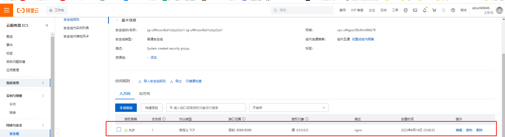

> 学习地址：

https://www.bilibili.com/video/BV1yS4y1N76R/?vd_source=0a56332f25bb0a46442ed613867bfdbc

> 参考博客

https://blog.csdn.net/learning_xzj/category_11792194.html

> SecureCRT 乱码

https://blog.csdn.net/oqqHuTu12345678/article/details/125888591


## nginx 版本

1. nginx 
   * http://nginx.org
2. nginx plus 商业版
   * https://ww.nginx.com
3. Openresty
   * http://openresty.org
4. Tengine
   * http://tengine.taobao.org/


## 安装

> 安装教程
>
> https://blog.csdn.net/t8116189520/article/details/81909574


## 启动指令

进入安装目录  /usr/local/nginx/sbin

```
./nginx 启动
./nginx -s stop 快速停止
./nginx -s quit 优雅的关闭
./nginx -s reload 重启
```

```
centOS6及以前版本使用命令： systemctl stop iptables.service

centOS7关闭防火墙命令： systemctl stop firewalld.service


开放80端口：

firewall-cmd --zone=public --add-port=80/tcp --permanent

查询端口号80 是否开启：

firewall-cmd --query-port=80/tcp

重启防火墙：

firewall-cmd --reload
 
随后访问该ip:端口 即可看到nginx界面。
```

服务器开放端口




> 服务脚本

```
vi /usr/lib/systemd/system/nginx.service
```

```
[Unit]
Description=nginx - web server
After=network.target remote-fs.target nss-lookup.target

[Service]
Type=forking
PIDFile=/usr/local/nginx/1ogs/nginx.pid
ExecStartPre=/usr/local/nginx/sbin/nginx -t -c /usr/local/nginx/conf/nginx.conf
ExecStart=/usr/local/nginx/sbin/nginx -c /usr/local/nginx/conf/nginx.conf
ExecReload=/usr/local/nginx/sbin/nginx -s reload
ExecStop=/usr/local/nginx/sbin/nginx -s stop
ExecQuit=/usr/local/nginx/sbin/nginx -s quit
PrivateTmp=true

[Install]
WantedBy=multi-user.target
```


``` 
# 重新加载系统服务
systemctl daemon-reload

# 查看nginx
ps -ef | grep nginx

# 关闭
./nginx -s stop

# 启动
systemctl start nginx

# 状态
systemctl status nginx

# 开机启动
systemctl enable nginx.service
```


## 目录结构

### 


